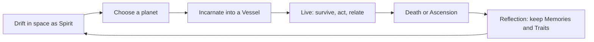

# 01 — Game Design

## 1. Core loop



1. **Drift** — fly as a point of light through a star system. Planets are visible with
   hints of their civilization (city lights, smog, ring stations, untouched forests).
2. **Choose** — approaching a planet reveals a short AI-written *omen*: tier, mood, danger,
   and one hook ("A plague spreads through the river cities").
3. **Incarnate** — descend; the game rolls a vessel and birth circumstances consistent with
   the planet's canon. The player may spend Spirit Energy to bias the roll.
4. **Live** — the main gameplay: move through scenes, talk to NPCs, work, trade, fight,
   flee, build relationships, and pursue goals while keeping needs satisfied.
5. **Death / Ascension** — the incarnation ends. Death costs SE; a fulfilled life refunds SE.
6. **Reflect** — the Narrative agent writes an epitaph; the player chooses which Memories
   to keep (limited slots) and may gain a Trait.

## 2. The Spirit phase (space)

- Controls: free 6-DoF flight (WASD + mouse, Q/E roll, Shift boost).
- The spirit leaves a light trail; boost consumes SE faster.
- **SE decay in space:** −0.5 SE per real minute. Space is beautiful but not safe to linger in.
- **Points of interest:** wandering echoes (fragments of other spirits — lore and small SE
  gains), anomalies (rare events), and planets.
- A star system contains 4–9 planets. Leaving a system through a *rift* generates a new
  system (new seed branch, new civilizations).

## 3. Incarnation

Landing is a cinematic dive through the atmosphere into a birth or arrival scene.

| Incarnation mode | Description | SE cost |
| --- | --- | --- |
| **Born** | Start as a child or young adult in a family; longest, richest life. | 5 |
| **Arrive** | Wake as an adult in a random role (traveler, worker, prisoner). | 10 |
| **Possess** (unlock) | Enter an existing NPC whose story is in progress. | 20 |

Vessel selection is constrained by the civilization: a T2 planet offers peasants, artisans,
soldiers, clergy, nobility; a T6 planet offers citizens, corporate workers, augmented
humans, androids. Non-human vessels (animals, AI constructs) are allowed if the planet's
canon contains them.

## 4. Survival and the four Dimensions

Each incarnation tracks needs across four dimensions. All values are 0–100.

| Dimension | Stats | Fails when |
| --- | --- | --- |
| **Physical** | Health, Hunger, Energy (fatigue), Exposure (cold/heat/radiation) | Health reaches 0 |
| **Social** | Reputation, Wealth, Relationships (per NPC), Legal Status | Exile/imprisonment loops can end a life |
| **Spiritual** | Resolve (morale), Insight | Resolve 0 causes despair: stats decay faster |
| **Temporal** | Age, Lifespan estimate | Age ≥ lifespan → natural death |

Rules (owned by the deterministic rules engine, tuned by the Rules/Balance agent):

- Hunger and Energy decay per tick; rates depend on tier and vessel.
- Exposure depends on scene environment (biome, weather, hazards).
- Health is damaged by combat, disease, accidents and starvation.
- Social stats change through actions, events and NPC opinion.
- Resolve rises with meaningful achievements and relationships; falls with loss and failure.

**Spirit Energy accounting at the end of a life:**

```
SE_delta = -base_death_cost(tier)
           + fulfillment_score * 0.3        // 0..100, from goals, relationships, insight
           + longevity_bonus                 // years lived / expected lifespan * 10
```

A life lived well can net positive SE; a reckless short life is expensive.

## 5. Actions and interaction

The player interacts through a small, fixed set of **verbs** so the rules engine can
resolve them deterministically, while the LLM supplies content and flavor:

`move`, `look`, `talk`, `give`, `take`, `use`, `buy`, `sell`, `work`, `rest`, `eat`,
`attack`, `flee`, `hide`, `craft`, `learn`, `travel` (between regions).

- `talk` opens a free-text dialogue with an NPC. The NPC agent replies in character and may
  return structured *intents* (offer job, give item, become hostile) that the rules engine
  validates and applies.
- Context-specific options appear as AI-generated **Choices** in the UI (see `05-dynamic-ui.md`),
  but each choice maps to verbs + parameters, never to arbitrary code.

## 6. Events and goals

- **Events** (`schemas/event.schema.json`) are generated by the Narrative agent on a
  cadence and in reaction to player actions: famine, festival, war, job offer, romance,
  crime, technological breakthrough.
- **Goals** are proposed at birth and at life milestones (e.g. "Become a master smith",
  "Escape the arcology", "Find your lost sister"). Completing goals raises fulfillment.
- The Director balances pacing: quiet stretches, rising tension, climaxes.

## 7. Progression across lives

- **Memories** (max 5 slots initially, +1 per 3 fulfilled lives): carried fragments such as
  "How to forge steel", "The face of the Queen of Asterra", "The word that opens the vault".
  Memories can surface as dialogue options, skill bonuses, or recognition of recurring
  characters on other planets.
- **Traits** (permanent): earned by notable lives, e.g. *Iron Will* (Resolve decays slower),
  *Silver Tongue* (better first impressions), *Technomancer* (faster tech learning on T5+).
- **Echoes:** the universe remembers the spirit's past lives. Returning to a planet later
  may reveal the consequences of the previous incarnation (descendants, ruins, legends).

## 8. Failure and end states

- **Spirit extinguished** (SE = 0): game over; the universe and its canon can be kept as a
  "legacy world" for a new spirit.
- **Transcendence** (long-term goal): accumulate enough Insight across all four dimensions
  and lives on every tier to ascend. Ending is AI-written from the spirit's whole history.

## 9. Difficulty settings

| Setting | SE decay | Death cost | Notes |
| --- | --- | --- | --- |
| Wanderer | ×0.5 | ×0.5 | Story-focused |
| Seeker | ×1 | ×1 | Default |
| Ascetic | ×1.5 | ×1.5 | Permadeath for vessels, harsher events |
