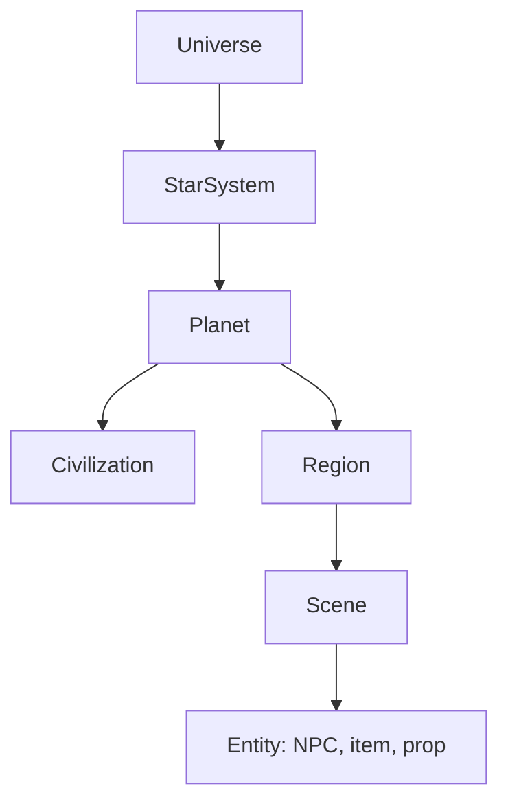

# 02 — World Model

## 1. Hierarchy

| Level | Generated by | When | Schema |
| --- | --- | --- | --- |
| Universe | Seed only (deterministic) | New game and after every death | `player-state` holds the seed |
| Star system | Procedural (seeded) + World Architect for names/omens | Entering system | part of `planet` list |
| Planet | World Architect | Player approaches (< N units) | `planet.schema.json` |
| Civilization | Civilization agent | With planet detail pass | `civilization.schema.json` |
| Region | World Architect (outline) | Planet detail pass | inside `planet` |
| Scene | Scene Designer + Asset Scout | Entering a region / scene | `scene.schema.json` |
| Entity / NPC | NPC agent | Scene population | `entity-npc.schema.json` |
| Event | Narrative agent | Ongoing | `event.schema.json` |

Each level is generated **lazily** and **coarse-to-fine**. A planet first exists as a
procedural sphere with a color palette and a one-line omen; it receives full detail only
when the player approaches.

## 2. Seeds and determinism

- `universeSeed` (64-bit) is created at new game and again after every death, so each
  life takes place in a new universe.
- Child seeds are derived by hashing: `seed(child) = hash(seed(parent), childKind, index)`.
- Procedural data (orbits, planet radius, palette, terrain noise) comes **only** from seeds.
- LLM-generated data is stored in canon once accepted; replays read it from canon rather
  than regenerating. See `07-safety-and-consistency.md`.

## 3. Civilization tiers

| Tier | Name | Era analog | Typical mechanics | Typical threats | UI theme |
| --- | --- | --- | --- | --- | --- |
| **T0** | Primordial | Wild world, no sapient civ | Foraging, shelter, animal vessels | Predators, weather | `organic` |
| **T1** | Tribal | Stone / bronze age | Hunting, gathering, rituals, kinship | Starvation, rival tribes, spirits | `bone-and-ochre` |
| **T2** | Feudal | Middle ages | Farming, crafts, guilds, coin, oaths | Plague, war, nobles, bandits | `parchment` |
| **T3** | Renaissance / Age of Sail | 1500–1750 | Trade routes, printing, early science | Inquisitions, piracy, colonial conflict | `ink-and-brass` |
| **T4** | Industrial | 1800–1950 | Factories, rail, wages, newspapers | Industrial accidents, labor strife, pollution | `steam-and-iron` |
| **T5** | Information | 1970–2040 | Computers, networks, jobs, media | Surveillance, economic precarity | `flat-digital` |
| **T6** | Interstellar / Cyber | Near-future sci-fi | Augmentation, AI, orbital travel | Corporate control, cyber-crime, rogue AI | `neon-holo` |
| **T7** | Post-singularity | Far future | Matter compilers, uploads, megastructures | Existential threats, incomprehensible entities | `luminous-minimal` |

Tiers are not strictly linear: a planet may have a `techProfile` that is uneven
(e.g. T2 society with T6 relic technology). Agents must respect the profile.

## 4. Planet model (summary)

A planet (`schemas/planet.schema.json`) has:

- **Physical:** radius, gravity, day length, climate, atmosphere, biomes, palette.
- **Civilization reference:** id of the dominant civilization and its tier.
- **Regions:** 3–12 named regions, each with biome, population density, danger level,
  key features and connections (a travel graph).
- **History:** a short timeline of 5–15 major events (used as canon).
- **Omen:** one-line hook shown from space.
- **Hooks:** 3–6 story seeds the Narrative agent can expand.

## 5. Civilization model (summary)

A civilization (`schemas/civilization.schema.json`) has:

- Tier and `techProfile` (per-domain tiers: agriculture, energy, medicine, weapons,
  communication, transport, computing).
- Government, economy, currency, religion/beliefs, social classes, laws and taboos.
- Factions with goals and relationships to each other.
- Naming conventions (phonetics, examples) so all agents name things consistently.
- Aesthetic: architecture, clothing, materials, color palette, music style —
  consumed by the Scene Designer and UI Generator.

## 6. Scene model (summary)

A scene (`schemas/scene.schema.json`) is the unit the Three.js client loads:

- Environment: terrain (heightmap params or flat), sky, fog, lighting, weather, ambient audio.
- Asset instances: references to `asset-manifest` entries with transforms.
- Procedural props: primitives or generators when no asset is available.
- NPC spawns and interactables (with verbs).
- Exits linking to other scenes / regions.
- Bounds and navmesh hints.

## 7. Time

- Space phase runs in real time.
- On planet: 1 tick = 1 in-game minute. Default 1 real second = 1 tick while exploring;
  time skips are available for `rest`, `work`, `travel` (resolved by the rules engine).
- The planet's calendar (from the civilization) drives seasons, festivals and events.

## 8. Cross-planet links

- Planets in the same system may be aware of each other (T6+ may trade or war across
  planets). The World Architect records inter-planet relations in canon.
- A universe lasts for one life only. After the player's death, a new `universeSeed` is
  drawn and the canon of the old universe is archived (kept for the run summary, never
  used for new content).
