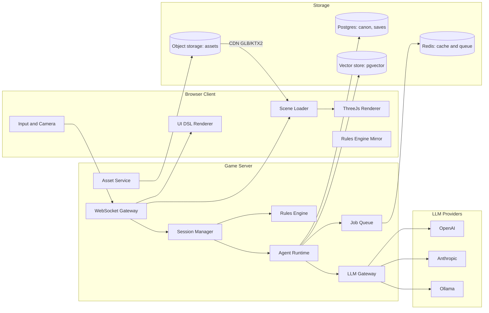

# 03 — Technical Architecture

## 1. System overview



## 2. Client (Three.js)

Stack: **TypeScript, Vite, Three.js**, `three/examples/jsm` loaders (GLTFLoader,
DRACOLoader, KTX2Loader, MeshoptDecoder), **Rapier** (WASM physics) for collision,
a small reactive UI layer (Preact or vanilla DOM) for the UI DSL renderer.

Modules:

| Module | Responsibility |
| --- | --- |
| `space/` | Star system view: instanced star field, planets (shader-based atmospheres), spirit particle + trail, bloom post-processing. |
| `planet/` | Atmospheric descent transition, surface scenes. |
| `scene-loader/` | Consumes `scene` JSON: builds terrain, sky, lights, fog; streams assets by priority (near first); spawns placeholders immediately and swaps in GLBs when loaded. |
| `entities/` | NPC avatars (asset or capsule placeholder), simple animation state machine, nameplates. |
| `ui-dsl/` | Renders `ui-layout` JSON with whitelisted components and tier themes. |
| `net/` | WebSocket client, message envelope, reconnect, partial-content patches. |
| `rules-mirror/` | Read-only copy of rules for client-side prediction (needs bars, timers). Server is authoritative. |
| `audio/` | Ambient beds and SFX from manifest; positional audio. |

Performance budget (mid-range laptop, 1080p): 60 FPS, ≤ 300k triangles visible,
≤ 150 draw calls (instancing for repeated props), ≤ 256 MB GPU texture memory.

## 3. Server

Stack: **Node.js 20+, TypeScript**, Fastify (HTTP) + `ws` (WebSocket), **BullMQ** on Redis
for jobs, **Postgres 16 + pgvector**, S3-compatible object storage (MinIO locally),
**Ajv** for JSON Schema validation.

Components:

- **Session Manager** — one session per connected player; holds `player-state`, current
  planet/scene, and pending generation jobs.
- **Rules Engine** — deterministic simulation: needs decay, verb resolution, combat,
  economy, SE accounting. Pure functions of (state, action, seed). Never calls an LLM.
- **Agent Runtime** — runs agents (see `04-multi-agent-system.md`), builds prompts from
  templates + context, validates output, writes canon.
- **LLM Gateway** — provider abstraction (section 5).
- **Asset Service** — asset search index, download, optimization pipeline, manifest store
  (see `06-asset-pipeline.md`).

## 4. Network protocol

All messages are JSON over WebSocket with an envelope:

```json
{ "type": "scene.patch", "id": "msg-123", "ts": 1759516800, "payload": { } }
```

Client → server: `hello`, `action` (verb + params), `dialogue.say`, `travel.request`,
`incarnate.request`, `reflect.choose`, `save`, `ping`.

Server → client: `state.update` (player-state diff), `planet.detail`, `scene.full`,
`scene.patch` (JSON Patch RFC 6902, used for streaming partial scenes), `npc.say`
(streamed tokens), `event.trigger`, `ui.layout`, `asset.ready`, `error`.

**Streaming strategy:** the server sends a minimal valid scene first (terrain, sky,
lighting, placeholders) within ~1 s, then patches as agents finish (asset swaps, NPCs,
UI). The player can move during generation.

## 5. LLM Gateway (provider-agnostic)

```ts
interface LLMProvider {
  id: "openai" | "anthropic" | "ollama" | string;
  complete(req: LLMRequest): Promise<LLMResponse>;
  stream(req: LLMRequest): AsyncIterable<LLMChunk>;
  supports: { jsonSchema: boolean; tools: boolean; vision: boolean };
}

interface LLMRequest {
  modelTier: "fast" | "strong" | "local";
  system: string;
  messages: { role: "user" | "assistant" | "tool"; content: string }[];
  responseSchema?: object;      // JSON Schema → native structured output when supported
  tools?: ToolDef[];
  maxTokens: number;
  temperature: number;
  seed?: number;
  cacheKey?: string;
  budget: { sessionId: string; maxCostUsd: number };
}
```

- **Model tiers** map to configured models per provider in `server/config/models.yaml`,
  e.g. `strong → claude-sonnet / gpt-4.1`, `fast → gpt-4.1-mini / claude-haiku`,
  `local → llama-3.1-8b-instruct (Ollama)`. Exact names are config, not code.
- **Structured output:** use the provider's native JSON-schema mode when available;
  otherwise inject the schema into the prompt and validate with Ajv (retry ≤ 2 with the
  validation errors).
- **Caching:** `cacheKey = sha256(templateId + templateVersion + canonicalized context + seed)`.
  Cache hits are free and make replays deterministic.
- **Budgets:** per-session token and cost ceilings; when exceeded, the gateway downgrades
  to `fast`/`local` tier, then to procedural fallbacks.
- **Failover:** provider error → next provider in the configured chain.
- **Observability:** every call logs template id, tokens, latency, cost, validation result
  (OpenTelemetry traces).

## 6. Persistence

| Data | Store |
| --- | --- |
| Canon facts (planets, civs, regions, NPCs, events) | Postgres JSONB tables, one row per entity, versioned |
| Canon embeddings for retrieval | pgvector |
| Player state, saves | Postgres |
| Asset binaries (GLB, KTX2, audio) | Object storage, served via CDN with immutable URLs |
| Asset manifests + search index | Postgres (+ pgvector for text/CLIP embeddings) |
| LLM response cache, job queue | Redis |

**Save/load:** a save = `universeSeed` + canon snapshot id + `player-state`. Because
procedural data comes from seeds and LLM data from canon, loading reproduces the world
exactly without calling an LLM.

## 7. Deployment

- Local dev: `docker compose` with Postgres, Redis, MinIO, Ollama; server and client in
  watch mode.
- Production: stateless game servers behind a WebSocket-aware load balancer (sticky
  sessions), separate worker pool for agent jobs and asset processing, CDN for assets.

## 8. Latency budgets

| Moment | Target | Technique |
| --- | --- | --- |
| Approach planet → omen visible | < 1.5 s | Pre-generated in batch when system is entered |
| Planet detail | < 8 s | Starts when the player turns toward the planet (speculative) |
| Land → playable scene | < 3 s | Minimal scene first, assets streamed |
| NPC first token | < 1 s | `fast` tier, streaming |
| Event generation | async | Never blocks gameplay |
