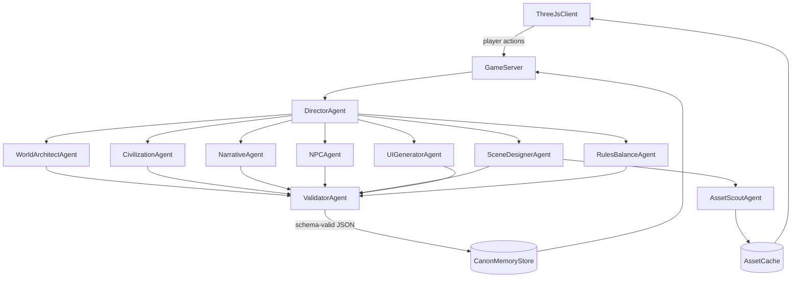
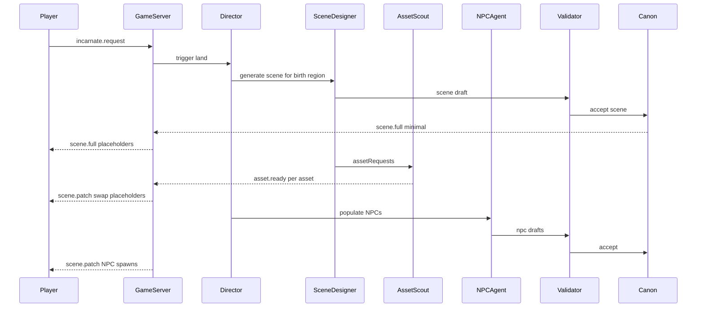

# 04 — Multi-Agent System

Spirit's content is produced by a team of specialized LLM agents coordinated by a
**Director**. Each agent has exactly one responsibility, a prompt template in `prompts/`,
and a JSON output contract in `schemas/`. Agents never touch game state directly: they
propose content, the **Validator** checks it, and only accepted content enters **Canon**.

## 1. Topology



## 2. Agent roster

| Agent | Role | Trigger | Output schema | Model tier | Latency budget | Fallback |
| --- | --- | --- | --- | --- | --- | --- |
| **Director** | Plans what to generate next; builds task DAGs; controls pacing and budget | Every game-state change of interest (approach, land, scene change, event timer) | `TaskPlan` (internal, section 5) | fast | < 1 s | Static rule-based planner |
| **World Architect** | Star systems, planets, regions, history, omens | Enter system (coarse), approach planet (detail) | `planet` | strong | < 8 s | Procedural planet from seed with template names |
| **Civilization** | Civilization detail: society, tech profile, factions, aesthetics, naming | Planet detail pass | `civilization` | strong | < 8 s | Tier template civilization |
| **Narrative** | Events, goals, epitaphs, omens, life story beats | Timers, player milestones, death | `event` | strong | async | Event deck of templated events |
| **NPC** | Creates NPCs; plays them in dialogue | Scene population; `dialogue.say` | `entity-npc`; dialogue reply (section 4.4) | fast (dialogue), strong (creation) | first token < 1 s | Canned lines by role |
| **Scene Designer** | Lays out playable 3D scenes; requests assets | Enter region/scene | `scene` | strong | minimal scene < 3 s; full < 15 s | Procedural scene generator per biome |
| **Asset Scout** | Finds, licenses, downloads and prepares 3D assets; appraises random Objaverse-XL objects that the spirit builds its body from (`09-found-bodies.md`) | Asset requests from Scene Designer; scene creation (12 found objects, one batched call) | `asset-manifest`, `found-object` | fast + tools | async per asset | Procedural/primitive placeholder; names from titles and a keyword tag table |
| **UI Generator** | Builds tier-themed UI layouts and contextual choices | Scene load, events, dialogue, menus | `ui-layout` | fast | < 1.5 s | Default layout per screen |
| **Rules/Balance** | Tunes numeric parameters for planet/tier/vessel within allowed ranges | Planet detail pass, incarnation | `balance` block inside `civilization` | fast | < 2 s | Tier default parameters |
| **Validator** | Schema + canon + safety checks; requests repairs | Every agent output | pass/fail + issues | fast (LLM part) | < 1 s | Reject → fallback of the producing agent |

## 3. Shared context model

Every agent call is assembled from layers so prompts stay small and consistent:

1. **System prompt** — the agent's template from `prompts/` (role, rules, output schema).
2. **World bible slice** — tier definitions, glossary, safety rules (static, cacheable).
3. **Canon retrieval** — top-K relevant canon facts from pgvector, plus *pinned* facts
   (current planet summary, civilization naming rules, current scene, player vessel).
4. **Task input** — the Director's task payload (what to make, constraints, ids to use).
5. **Output schema** — passed to the provider's structured-output mode.

Context limit per call: target ≤ 8k input tokens; retrieval is trimmed to fit.

## 4. Agent contracts (detail)

### 4.1 Director

- **Input:** game event (`approach_planet`, `land`, `enter_scene`, `tick_window`,
  `player_death`, ...), session summary, budget status, list of pending/cached content.
- **Output:** `TaskPlan` — a DAG of tasks with priorities and deadlines.
- **Rules:** prefer cached/canon content; never request what already exists; schedule
  speculative generation for likely next destinations; downgrade quality when budget is low.

### 4.2 World Architect

- **Input:** system seed, procedural planet parameters (radius, orbit, palette, climate
  from seed), desired tier mix of the system, existing planets in system.
- **Output:** `planet` (regions, history, hooks, omen). Must keep procedural physical values
  unchanged; may only add names, descriptions and structure.

### 4.3 Civilization

- **Input:** planet record, tier, optional uneven tech hints.
- **Output:** `civilization` including `aesthetic`, `naming`, `factions`, `balance`.
- **Rules:** all technology mentioned must be within the `techProfile`. Naming conventions
  must include ≥ 10 example names so later agents imitate them.

### 4.4 NPC

- **Creation output:** `entity-npc` (identity, role, appearance, personality, goals,
  knowledge, relationships, schedule, inventory).
- **Dialogue output** (streamed text + trailing JSON):

```json
{
  "say": "Bread's two copper. Same as yesterday, same as tomorrow.",
  "emotion": "weary",
  "intents": [{ "type": "offer_trade", "itemId": "item-rye-bread", "price": 2 }],
  "opinionDelta": 1,
  "revealedFacts": []
}
```

- Intents are restricted to: `offer_trade`, `offer_job`, `give_item`, `request_item`,
  `share_info`, `become_hostile`, `flee`, `follow`, `call_guard`, `end_conversation`.
  The rules engine validates intents (e.g. the NPC must own the item).
- NPCs only know facts in their `knowledge` list plus public canon for their region.

### 4.5 Narrative

- **Input:** planet, civilization, player-state summary, recent events, active goals,
  pacing signal from Director (`calm` / `rising` / `climax` / `resolution`).
- **Output:** `event` with conditions, choices (mapped to verbs/effects) and consequences.
- Also produces epitaphs and reflection text at death (free text with `event` type `epitaph`).

### 4.6 Scene Designer

- **Input:** region record, civilization aesthetic, time of day/weather, required
  interactables (from active events/goals), asset catalog hits for the tier and biome.
- **Output:** `scene`. For each needed object it emits either an `assetRef` (existing
  manifest id) or an `assetRequest` (text query + constraints) plus a `procedural` fallback.
- **Rules:** keep within bounds; respect performance budget (`maxTriangles`,
  `maxInstances`); place spawn point on walkable ground; every exit must reference a known
  region/scene id or a `pending` id the Director will generate.

### 4.7 Asset Scout (tool-using agent)

Tools available:

| Tool | Purpose |
| --- | --- |
| `search_catalog(query, filters)` | Search local index (already ingested assets) |
| `search_source(source, query, filters)` | Query external source APIs / dataset metadata |
| `inspect_candidate(id)` | Fetch metadata: license, author, polycount, textures, thumbnails |
| `vision_score(thumbnailUrl, query)` | Optional VLM/CLIP relevance + quality score |
| `ingest(candidateId)` | Download → convert → optimize → normalize → manifest (deterministic pipeline, see `06-asset-pipeline.md`) |

- **Output:** `asset-manifest` for the chosen asset, or `{ "status": "not_found" }`.
- **Rules:** license must be on the allow-list; prefer existing catalog hits; prefer CC0;
  never ingest more than the per-scene asset budget.

### 4.8 UI Generator

- **Input:** screen kind (`hud`, `dialogue`, `inventory`, `event`, `omen`, `reflection`,
  `menu`), tier theme, data bindings available, current choices from events/NPC intents.
- **Output:** `ui-layout` tree (whitelisted components only). See `05-dynamic-ui.md`.

### 4.9 Rules/Balance

- **Input:** tier defaults, planet physical traits, civilization, vessel.
- **Output:** numeric parameters (decay rates, prices, danger multipliers) **clamped** to
  ranges defined by the rules engine. The rules engine re-clamps regardless.

### 4.10 Validator

Two stages:

1. **Deterministic:** Ajv schema validation; id format; referential integrity (ids exist in
   canon or are declared pending); numeric ranges; asset license allow-list; profanity /
   safety filter; tech-tier check against `techProfile` keyword lists.
2. **LLM review (fast tier, sampled or on high-impact content):** canon contradiction
   check against retrieved facts; tone/rating check.

Result: `accept`, `repair` (returns issues to the producing agent; max 2 repair rounds),
or `reject` (Director uses fallback).

## 5. Orchestration

### 5.1 TaskPlan

```json
{
  "planId": "plan-0042",
  "trigger": "land",
  "tasks": [
    { "id": "t1", "agent": "scene-designer", "input": { "regionId": "region-millford" }, "priority": 0, "deadlineMs": 3000 },
    { "id": "t2", "agent": "npc", "input": { "sceneId": "$t1.id", "count": 6 }, "dependsOn": ["t1"], "priority": 1 },
    { "id": "t3", "agent": "ui-generator", "input": { "screen": "hud" }, "priority": 0 },
    { "id": "t4", "agent": "narrative", "input": { "pacing": "calm" }, "dependsOn": ["t2"], "priority": 2 }
  ]
}
```

- Tasks run in parallel where dependencies allow (BullMQ flows).
- `$t1.id` style references are resolved by the runtime after the dependency completes.
- `priority 0` tasks stream to the client as soon as they validate.

### 5.2 Sequence: landing on a planet



### 5.3 Generation levels of detail

| Player state | Generated |
| --- | --- |
| Enter system | All planets: procedural + omen + tier (batch, 1 call) |
| Look at / approach planet | That planet: `planet` + `civilization` (speculative) |
| Land | Birth region scene + NPCs + HUD + first goals |
| In region | Adjacent scenes pre-generated at low priority |
| Leave planet | Planet summarized and compressed in canon |
| Player death | Epitaph; old canon archived; new universe seed drawn; first star system of the new universe pre-generated during the reflection screen |

## 6. Memory

- **Canon store:** authoritative facts (structured JSON per entity, versioned), scoped to
  the current universe. Agents never retrieve canon from a previous life's universe.
- **Semantic memory:** embeddings of canon summaries and dialogue highlights for retrieval.
- **Session memory:** rolling summary of the current life (updated every N events by the
  Narrative agent in `fast` tier) to keep prompts short.
- Nothing from previous lives is given to agents. The only cross-life value, Spirit Energy,
  is owned by the rules engine.

## 7. Failure handling

| Failure | Response |
| --- | --- |
| Provider timeout/error | Failover provider → lower tier → fallback generator |
| Schema invalid after repairs | Reject; use fallback; log for prompt tuning |
| Canon contradiction | Repair with explicit conflicting facts in the prompt |
| Asset not found | Procedural placeholder stays; Scout retries later with relaxed query |
| Budget exhausted | Director switches to `local`/procedural for the rest of the session |

## 8. Evaluation

- Golden-set tests per agent: fixed inputs, schema validity rate ≥ 99%, canon
  contradiction rate < 2% (LLM judge), latency p95 within budget.
- Playtest telemetry: generation wait time, fallback rate, NPC dialogue rating, session length.
