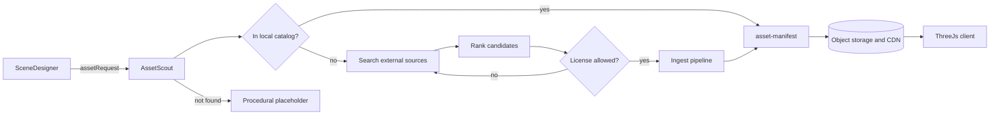

# 06 — 3D Asset Pipeline

The **Scene Designer** decides *what* objects a scene needs. The **Asset Scout** finds
*which* freely licensed, high-quality 3D model best fits each need, then the deterministic
**ingest pipeline** downloads, converts, optimizes and registers it. The client only ever
loads optimized GLB files from our own object storage, never directly from third-party sites.

## 1. Flow



## 2. Sources

Ordered by default priority (license clarity first, then quality and size).

| Source | Type | License | Access | Notes |
| --- | --- | --- | --- | --- |
| [Poly Haven](https://polyhaven.com) | Models, HDRIs, textures | CC0 | Public API (`api.polyhaven.com`) | Excellent quality; HDRIs for skies |
| [Kenney](https://kenney.nl/assets) | Stylized low-poly packs | CC0 | Bulk download, pre-ingested | Great for fallbacks and props |
| [Quaternius](https://quaternius.com) | Low-poly packs, animated characters | CC0 | Bulk download, pre-ingested | Rigged characters for NPCs |
| [ambientCG](https://ambientcg.com) | PBR materials | CC0 | Public API | Terrain and building materials |
| [Smithsonian Open Access](https://www.si.edu/openaccess) | Scanned artifacts | CC0 (check per item) | API | Historical objects for T1–T4 |
| [Sketchfab](https://sketchfab.com) | Huge model library | Per model (CC0, CC-BY, ...) | Data API v3 (downloadable + license filter, requires API token) | Only `downloadable=true` and allowed licenses |
| [Objaverse](https://objaverse.allenai.org) | ~800k+ models (mostly Sketchfab-sourced) | Per object | Python package / HF dataset metadata | Use metadata for search; verify license per object |
| [Objaverse-XL](https://huggingface.co/datasets/allenai/objaverse-xl) | 10M+ objects from Sketchfab, GitHub, Thingiverse, Smithsonian | Per object (~3M CC0/CC-BY) | Per-source Parquet metadata on Hugging Face, sampled with HTTP range reads | Random found objects for player bodies (`09-found-bodies.md` §4) |
| [TexVerse](https://github.com/yiboz2001/TexVerse) | High-resolution textured 3D models dataset | Per object (sourced from Sketchfab) | GitHub / dataset metadata | High texture quality; **per-object license check required** |
| Generated (future) | Text-to-3D (e.g. TRELLIS, Hunyuan3D) | Our own output | Self-hosted | Last resort before primitives; review model license |

Bulk CC0 packs (Kenney, Quaternius, selected Poly Haven) are **pre-ingested** at build time
so every tier and biome has a guaranteed baseline catalog with zero runtime download risk.

## 3. License policy

Allow-list (stored in config, enforced by the Validator and the ingest pipeline):

| License | Allowed | Requirement |
| --- | --- | --- |
| CC0 / Public Domain | yes | none (attribution still recorded) |
| CC-BY 4.0 / 3.0 | yes | Attribution shown in Credits and asset inspector |
| CC-BY-SA | no (v1) | Share-alike complicates distribution |
| CC-BY-NC / NC-* | no | Non-commercial restriction |
| CC-BY-ND | no | We modify assets (decimation, texture compression) |
| Editorial / unknown / "Standard" store licenses | no | |

Rules:

- The license is read from the **source's metadata at ingest time** and stored with a
  snapshot (license id, URL, author, source URL, retrieval date).
- Dataset metadata (Objaverse, TexVerse) is treated as a hint only; the pipeline re-checks
  the original page/API when possible before ingesting.
- Assets with ambiguous licenses are rejected.
- A credits screen is auto-generated from all manifests used in the player's universe.

## 4. Search and ranking

Local index (Postgres + pgvector) built from:

- Text: name, tags, categories, description → text embedding.
- Image: thumbnail → CLIP embedding (enables text→image similarity).
- Facts: triangle count, texture resolution, PBR channels present, animated/rigged,
  file size, license, source.
- Spirit labels: `tiers[]`, `biomes[]`, `style` (realistic / stylized / low-poly), added by
  a one-time `fast` LLM labeling pass.

**Score:**

```
score = 0.45 * semantic(query, text+image)
      + 0.15 * tierFit + 0.10 * styleFit
      + 0.10 * quality(textureRes, pbr, reviews)
      + 0.10 * budgetFit(triangles, fileSize)
      + 0.10 * licensePreference(CC0 > CC-BY)
```

Optional: a vision-language model views the top-5 thumbnails and picks the best match
(`vision_score` tool). Style consistency within a scene is enforced by preferring assets
whose `style` matches the scene's `stylePreference`.

## 5. Ingest pipeline (deterministic, no LLM)

Implemented as a worker job (`tools/asset-pipeline`) using
[`@gltf-transform/cli`](https://gltf-transform.dev), Blender (headless, for FBX/OBJ/BLEND
conversion), and `toktx` / KTX-Software.

1. **Download** original archive to quarantine storage; size limit 200 MB; virus/type check.
2. **Convert** to glTF 2.0 / GLB (Blender headless for non-glTF formats).
3. **Validate** with `gltf-validator`; reject on errors.
4. **Normalize**
   - Up axis +Y, forward −Z, units meters.
   - Pivot at bottom-center; compute AABB.
   - Real-world scale estimate: the Scout supplies an expected size (e.g. cart ≈ 3 m long);
     scale to match if the model's size is off by > 3×.
5. **Optimize**
   - `gltf-transform dedup`, `prune`, `weld`, `resample` (animations).
   - Geometry: `simplify` to produce LODs (LOD0 ≤ 50k tris, LOD1 ≈ 30%, LOD2 ≈ 10%).
   - Compression: Meshopt (default) or Draco.
   - Textures: resize to ≤ 2048 (≤ 1024 for small props), convert to **KTX2** (ETC1S for
     color, UASTC for normal maps).
6. **Thumbnail** render (for UI and future ranking).
7. **Manifest** written (`schemas/asset-manifest.schema.json`) with hashes, sizes, LOD
   URLs, bounds, license snapshot.
8. **Publish** to object storage under content-hashed immutable paths; CDN caches forever.

## 6. Placement in scenes

The Scene Designer emits instances:

```json
{
  "id": "inst-cart-01",
  "assetRef": "asset-ph-wooden-cart",
  "transform": { "position": [12.0, 0, -4.5], "rotationY": 1.2, "scale": 1 },
  "placement": { "snapToGround": true, "collider": "box", "avoidOverlap": true }
}
```

or, when no catalog asset is known yet:

```json
{
  "id": "inst-cart-01",
  "assetRequest": { "query": "medieval wooden hand cart", "expectedSize": [3, 1.2, 1.4], "style": "realistic", "maxTriangles": 15000 },
  "procedural": { "kind": "box", "size": [3, 1.2, 1.4], "material": "wood" },
  "transform": { "position": [12.0, 0, -4.5], "rotationY": 1.2, "scale": 1 },
  "placement": { "snapToGround": true, "collider": "box", "avoidOverlap": true }
}
```

Client behavior:

- Render `procedural` placeholder immediately.
- On `asset.ready`, load LOD by distance, fit to the placeholder's bounds (preserving
  aspect ratio), snap to ground via raycast, generate a collider (box / convex hull).
- Repeated assets use `InstancedMesh`.
- Overlap resolution: a simple post-pass nudges instances apart along the XZ plane.

## 7. Characters and animation

- NPC bodies prefer rigged, animated CC0 characters (Quaternius, Mixamo-compatible
  rigs from allowed sources) with a shared animation set (idle, walk, run, talk, work, die).
- Appearance variety comes from material tinting and accessory props per civilization aesthetic.
- If no fitting character exists, a stylized capsule avatar with tier-appropriate color
  coding is used.

## 8. Skies, terrain and materials

- Skies: Poly Haven HDRIs selected by time-of-day and climate; procedural sky shader as fallback.
- Terrain: procedural heightmap from seed; splat materials from ambientCG chosen by biome.
- Buildings: modular kits (Kenney, Quaternius) arranged by the Scene Designer; hero
  buildings from Sketchfab/TexVerse when available.

## 9. Budgets

| Budget | Default |
| --- | --- |
| New external assets ingested per scene | ≤ 8 |
| Triangles visible per scene | ≤ 300k |
| Download size for first playable view | ≤ 20 MB |
| Ingest job timeout | 120 s |
| Max catalog size (dev) | 50 GB |

## 10. v0.1 implementation status

`server/src/agents/assetScout.ts` and `server/src/assets/` implement a reduced version of
this pipeline:

- **Sources:** Poly Haven (public API), then Sketchfab when `SKETCHFAB_API_TOKEN` is set.
  The Sketchfab license is re-read from the model page before download.
- **Ranking:** keyword matching instead of embeddings or an LLM pick, so it makes no model
  calls. The head noun of the query must match. Poly Haven candidates must also be within 3×
  of `expectedSize`, using their published real-world dimensions.
- **Ingest:** download only, no conversion, LODs or KTX2. Poly Haven glTF uses 1k textures;
  Sketchfab GLB is capped at 30 MB. The triangle limit comes from `assetRequest.maxTriangles`.
- **Delivery:**
  - The server serves files from `DATA_DIR/assets/<asset-id>/` at `/assets/...`.
  - The `scene` message carries the manifests that are already resolved.
  - An `asset` message announces each model as it becomes ready.
  - The client fits each model to the placeholder's height and caps its footprint.

## 11. Legal and safety notes

- Never hotlink third-party files to clients; always serve ingested copies.
- Respect each source's terms of service and API rate limits; use official APIs or
  published datasets, not scraping.
- Keep the license snapshot forever; if a source later reports a takedown, the asset can be
  disabled by id and scenes fall back to placeholders.
