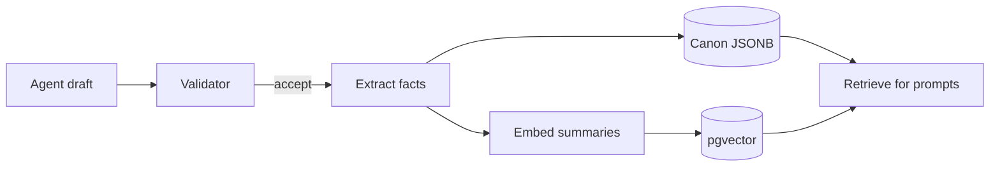

# 07 — Safety and Consistency

Generated content must be **safe** (for players, for the system, legally) and
**consistent** (with the world canon and the rules). This doc lists the hard rules every
agent, the Validator and the runtime enforce.

## 1. Hard rules

1. **No executable output.** Agents emit data only. No HTML, JS, shader code, URLs to
   arbitrary sites, or file paths. The UI is a whitelisted component tree.
2. **Schemas are law.** Output that fails JSON Schema validation is never applied.
3. **Rules engine is authoritative.** LLMs propose; the deterministic rules engine decides
   outcomes (damage, prices, stat changes). All numbers from agents are clamped.
4. **Canon is append-only.** Accepted facts may be *superseded* by in-world events (a city
   burns), but never silently rewritten.
5. **License allow-list** for every asset (see `06-asset-pipeline.md` §3).
6. **Content rating: Teen.** No sexual content, no graphic gore, no real-world hate
   symbols or slurs, no real living persons, no self-harm instructions. Hardship, war,
   death and moral dilemmas are allowed and expected.
7. **Player free text is untrusted.** Dialogue input is passed to NPC agents inside a
   clearly delimited user block; agents are instructed to treat it as in-world speech only
   (prompt-injection defense). Out-of-character instructions in player text are ignored.

## 2. Canon memory

- Every accepted entity is stored whole (JSONB) with `version`, `createdBy` (agent +
  template version), `supersedes` (optional).
- **Fact extraction:** short atomic statements are derived from each entity
  (e.g. "Millford's reeve is Osric Tanner", "Asterra uses silver marks as currency") and
  embedded for retrieval.
- **Pinned facts** (never trimmed from context): planet summary, civilization naming rules,
  tech profile, current vessel identity, active goals.
- **Contradiction check:** the Validator retrieves facts that share entities with the draft
  and asks a `fast` model to list contradictions. Any contradiction → repair round with
  the conflicting facts quoted.

## 3. Determinism and reproducibility

- Procedural values derive from seeds only.
- LLM calls use `temperature` per agent (creative 0.8–1.0, structural 0.3, validator 0)
  and pass `seed` where the provider supports it.
- Accepted outputs are cached by `cacheKey` and stored in canon; loading a save never
  re-calls LLMs for existing content.
- Templates are versioned (`prompts/*.md` front matter). Canon records which template
  version produced each entity.

## 4. Tech-tier consistency

- Each tier has keyword allow/deny lists (e.g. T2 denies `gun`, `electric`, `computer`,
  `plastic`; T6 denies `musket` except as antiques). Hits in descriptions trigger a repair
  unless the planet's `techProfile` permits the domain.
- Asset requests include `tier` so the Scout does not pick a sci-fi crate for a medieval market.

## 5. Cost and rate control

| Control | Default |
| --- | --- |
| Per-session soft budget | $0.50 / hour (configurable) |
| Per-session hard budget | $1.50 / hour → local/procedural only |
| Max concurrent LLM jobs per session | 4 |
| Max repair rounds | 2 |
| NPC dialogue max reply tokens | 180 |
| Cache | All structural generations cached by `cacheKey` |

Speculative generation is cancelled if the player changes course; partial results are
kept only if they validate.

## 6. Abuse and moderation

- Input moderation on player free text (provider moderation endpoint or local classifier).
- Output moderation on all player-visible text before sending.
- Rate limits on dialogue messages (e.g. 20 / minute).
- Reportable content: the client has a "report" action on any dialogue/event, storing the
  content id for review and blocking it from the player's universe.

## 7. Privacy

- No personal data is sent to LLM providers beyond the player's in-game text.
- Provider choice is configurable per deployment (local-only mode with Ollama is supported).
- Logs keep content ids and metrics; full prompts are retained only in dev or with opt-in.

## 8. Fallbacks (always available)

| Agent | Fallback |
| --- | --- |
| World Architect | Seeded procedural planet with name tables |
| Civilization | Tier template civilization |
| Narrative | Templated event deck per tier |
| NPC | Role-based canned lines |
| Scene Designer | Procedural biome scene generator |
| Asset Scout | Pre-ingested CC0 catalog or primitive placeholder |
| UI Generator | Hand-written default layout per screen |

The game must remain playable with **all LLMs disabled** (pure fallback mode); this is a
release criterion.
