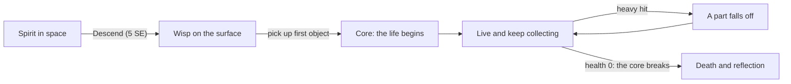

# 09 — Found Bodies

Status: **design, not yet built.** This replaces the *Born* and *Arrive* incarnation modes
(`01-game-design.md` §3) for new lives.

The spirit lands on a planet as a point of light. Random real 3D objects lie scattered
around the scene: a kettle, a fossil, a traffic cone, a statue, a 3D-printed gear. The
player sticks them together into a body, in the spirit of the game *SWAPMEAT*: what you are
made of decides how you move, what you are good at and how people treat you.

## 1. Flow

1. **Descend.** Approaching a planet now offers a single action, *Descend* (5 SE). The
   player lands in one of the planet's scenes as a **wisp**.
2. **Wisp.** The wisp flies freely (WASD, Space/C for up and down) a little above the
   ground. It cannot talk, work or trade; NPCs only notice "a strange light". Spirit Energy
   drains at 1 SE per real minute, twice the rate in space, so lingering bodiless is costly.
3. **Loose objects** glow faintly on the ground. Pressing E near one starts **placement**:
   - The first object becomes the **core**; it is placed upright under the wisp.
   - Every later object sticks to the side of the body facing the camera, at a random point
     on that side.
   - R re-rolls the point, the mouse wheel scales the object (0.5x to 2x), E confirms,
     Esc cancels and leaves the object where it was.
4. **The life begins** when the core is placed: the rules engine creates the incarnation
   (stats, goals, starting money), and the Narrative agent names the new being in the
   civilization's naming style.
5. **Swap.** X drops the most recently added part back onto the ground; picking up another
   object adds it. A body holds the core plus at most **8 parts**.
6. **Damage.** A single hit of 15+ health (failed bold choices, hostile NPCs, hazards)
   knocks a random non-core part off; it lands nearby as a loose object again.
7. **Death.** When health reaches 0 the core breaks and the life ends exactly as today
   (`01-game-design.md` §7): epitaph, SE accounting, new universe.

## 2. The body

- A body is a rigid assembly: the core plus parts with a position, rotation and scale
  relative to the core. There is no skeleton; the body moves with a hop-and-bob animation
  and leans into turns. Parts can be anywhere, which is the point.
- Every object is normalized when loaded: pivot at its bounding-box center, largest side
  scaled to the size the appraisal suggests (0.2 m to 1.5 m for parts, 0.6 m to 1.8 m
  for a core).
- Collisions use one capsule around the whole body.

## 3. Traits and stats

The LLM never writes numbers (`04-multi-agent-system.md`). It appraises each object with a
name, a one-line description and up to 4 **tags** from a fixed vocabulary; code turns tags
into trait points.

| Tag | Trait points |
| --- | --- |
| heavy, sturdy, armored, stone, metal | sturdy +2 |
| light, wheeled, winged, springy, fast | nimble +2 |
| electronic, mechanical, bookish, precise | clever +2 |
| pretty, cute, shiny, musical, tasty | charming +2 |
| scary, sharp | charming -1, sturdy +1 |
| fragile | sturdy -1 |

Each object has four traits, `sturdy`, `nimble`, `clever` and `charming`, from 0 to 10
(base 2, plus tag points, clamped). The body's totals (core counts double) set:

| Effect | Formula (initial tuning) |
| --- | --- |
| Max health | 40 + 3 x sturdy, capped at 100 |
| Move speed | 3.0 + 0.12 x nimble m/s, capped at 6.5 |
| Work pay | x (0.8 + 0.02 x clever), capped at x1.6 |
| First opinion of new NPCs | +(charming - 2 x scary parts), clamped to -20..+20 |

Needs (hunger, energy, exposure) work as today: the spirit still needs food and rest to
hold its body together.

## 4. Where the objects come from: Objaverse-XL

Objects are drawn at random from
[Objaverse-XL](https://huggingface.co/datasets/allenai/objaverse-xl), whose metadata is
one Parquet file per source with `fileIdentifier`, `source`, `license`, `fileType`,
`sha256` and `metadata` columns. Only CC0, public-domain and CC-BY objects are used
(`07-safety-and-consistency.md`); counts are from the October 2026 metadata.

| Source | Usable objects | Formats used | Download | License check before download |
| --- | --- | --- | --- | --- |
| Sketchfab | ~706,000 (CC-BY, CC0) | GLB | Objaverse mirror on Hugging Face (`allenai/objaverse` `glbs/`, located via `object-paths.json.gz`); no key | Sketchfab API `/v3/models/{uid}`: license slug `by` or `cc0`, not age-restricted |
| Smithsonian | 2,407 (CC0) | GLB | Direct URL from the metadata | Smithsonian Open Access is CC0 |
| GitHub | ~1,500 (CC0, CC-BY) | GLB, STL, OBJ (no textures) | `raw.githubusercontent.com` at the recorded commit | GitHub API repo license (optional `GITHUB_TOKEN` for rate limits) |
| Thingiverse | ~2,250,000 (CC-BY, CC0, PD) | STL (no textures) | Thingiverse API, **only when `THINGIVERSE_TOKEN` is set** | Thingiverse API thing license |

Rejected: `.blend`, `.fbx`, `.dae`, `.gltf` with external files, Polycam (non-commercial),
anything with NC, ND or SA terms, missing licenses, and software licenses such as MIT.

**Sampling.** The server never downloads the full metadata. It keeps a pool of about 300
ready objects:

1. Pick a source (weights: Sketchfab 0.6, Smithsonian 0.15, GitHub 0.15, Thingiverse 0.1
   when enabled), then a random window of 1,000 rows, read with HTTP range requests.
2. Keep rows with an allowed license and format.
3. Re-check the license at the source, download (limit 15 MB), estimate triangles
   (limit 50k) and register an `asset-manifest`.
4. Untextured formats get a material tinted from the planet palette.

**Names.** Sketchfab names come from the license-check API call. Smithsonian has titles.
GitHub and Thingiverse only have file names, which the appraiser turns into a readable
name ("gear_v2_final.stl" becomes "Toothed Gear").

## 5. Appraisal (Asset Scout, LLM step)

When a scene is created, 12 objects are drawn from the pool and appraised in **one batched
LLM call** (`prompts/object-appraiser.md`) producing `found-object` records: name,
description, tags, and an `unsuitable` flag. Flagged objects (adult, gore or hate content
that slipped through, or anything that breaks the Teen rating) are discarded and replaced.
Fallback without an LLM: the name is cleaned from the title or file name, and tags come
from a keyword table.

## 6. Contract changes

| Contract | Change |
| --- | --- |
| `player-state` 1.1 → 1.2 | `incarnation.mode` adds `assembled` (`born` and `arrive` stay valid for old saves); `vessel.kind` adds `assembled`; new `incarnation.body` |
| `found-object` 1.0 (new) | An appraised object: asset reference, name, description, tags, traits |
| `asset-manifest` 1.0 → 1.1 | `source.name` adds `github` and `thingiverse` |
| Ids (`AGENTS.md`) | `obj-` for found objects, `part-` for attached parts |
| Prompts | New `prompts/object-appraiser.md`; `prompts/npc.md` receives the body description |

Loose objects lying in a scene are runtime state of the session (like NPC positions),
not part of the `scene` schema.

## 7. Credits and safety

- Every object in view (loose or part of the body) is listed in the credits bar with the
  attribution from its manifest.
- Sketchfab models flagged age-restricted are rejected; the appraiser's `unsuitable` flag
  is the second filter.
- As with scene models, nothing is hotlinked: clients load only `/assets/...` copies.

## 8. Old saves

A save from before this change keeps its current life with its legacy vessel and capsule
avatar until that life ends; the next life uses found bodies.

## 9. Deferred

- Physics (parts wobbling, falling over) and per-part animation.
- Parts with special verbs (a lamp that lights the way, wheels that let you roll).
- Combat built around knocking parts off NPCs.
- Possession.
